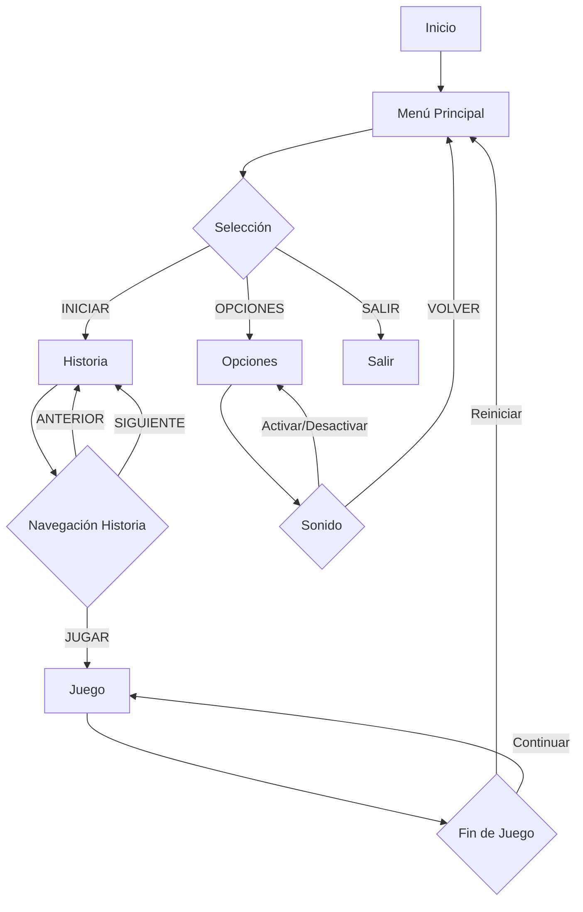

# 🎮 Fantasma Come Hamburguesas
---
https://jhormancastella.github.io/Fantasma_Come_Hamburguesas/
---

## 📖 Descripción

Fantasma Come Hamburguesas es un juego de plataformas y acción donde controlas a alex, un fantasma que recolecta que antes era un joven fanatico alas hamburguesas, en mundos llenos de plataformas, monedas, enemigos y power-ups. El objetivo es superar niveles, evitar fantasmas enemigos y lograr la máxima puntuación.

---

## 🎯 Características

- Historia interactiva de Alex
- Niveles de dificultad: Fácil, Medio, Difícil
- Controles para PC y móviles
- Efectos visuales: CRT y consola portátil
- Sonido programático con Web Audio API
- Sistema de vidas, puntuación y power-ups

---

## 🛠️ Requisitos

**PC:**  

- Navegador reciente (Chrome, Firefox, Safari, Edge)  
- RAM: 2 GB mínimo  
- Resolución: 1920x1080+  
- Offline: Sí

**Android:**  

- Android 5.0+  
- Navegador compatible  
- RAM: 1 GB mínimo  
- Almacenamiento: 50 MB

---

## 📥 Modo de juego actual

**Actualmente por navegador:**
---

**PC:**
---

---

**Android:**
---

---

## 📥 Descargas proximamente en

**PC:**  

- [Descargar ZIP](#)  
    Contiene: `FCH.exe`, `assets/`  
    1. Descarga y descomprime  
    2. Abre `FCH.exe`  
    3. Juega offline  
- archivo .exe en creacion (Proximamente).

**Android:**  

- [Descargar APK](#)
    1. Descarga e instala `FCH.apk`
    2. Abre la app `FCH`
- apk en creacion (Proximamente).

---

## 🎮 Diagrama de Flujo

---

## 🔄 Flujo de Juego

- Menú: Selector de dificultad, INICIAR, OPCIONES, SALIR
- Historia: 8 diapositivas, navegación ANTERIOR/SIGUIENTE, última inicia juego
- Juego: Control de Rosy, monedas, enemigos, power-ups, vidas, puntuación
- Opciones: Sonido, volver al menú

---

## 🎮 Controles

**PC:**  

- Movimiento: ← →  
- Salto: ↑ o Espacio  
- Pausa: P  
- Iniciar: Enter

**Móvil:**  

- Movimiento: DPAD  
- Salto: Botón A  
- Salto Alto: Botón B  
- Pausa: Botón P

---

## 🏆 Puntuación

- Moneda: +10 puntos
- Bonus tiempo: +5 puntos/segundo
- Vida extra: +1 vida (power-up verde)
- Velocidad: +3 velocidad por 5 segundos (power-up amarillo)

---

## 🎨 Técnicas

- Sonido: Web Audio API, efectos de salto, moneda, colisión, power-up, nivel, game over
- Gráficos: HTML5 Canvas, CRT, consola portátil, responsive
- Física: Gravedad variable, colisiones precisas, cámara dinámica

---

## 📝 Instrucciones

1. Descarga la versión adecuada
2. Instala Abir el navegador en Android o abre HTML en PC
3. Selecciona dificultad y disfruta la historia
4. ¡Comienza la aventura!

**Consejos:**  

- Recolecta todas las monedas  
- Usa power-ups de vida extra  
- Salta sobre enemigos  
- Explora para encontrar power-ups  
- Completa niveles rápido para bonus

---

## 🔧 Problemas Comunes

- **No carga:** Verifica navegador, actualiza, revisa conexión
- **Controles:** Enfoca canvas (PC), toca pantalla (móvil), recarga
- **Sonido:** Activa volumen, revisa configuración, prueba auriculares
- **Lento:** Cierra apps, reinicia, reduce calidad gráfica

---

## 📄 Legal

**Derechos de Autor:**  
© 2025 Jhorman Castellanos. Todos los derechos reservados.  
Prohibida la reproducción, distribución o modificación sin autorización.

**Licencia:**  

- Personal: Gratuito  
- Comercial: Requiere autorización  
- Modificación: No permitida sin permiso  
- Distribución: Solo canales oficiales

---

---

## 🔄 Actualizaciones

**1.0.0:**  

- Lanzamiento inicial  
- Menú, historia, opciones  
- Puntuación, sonido, responsive

**Próximas:**  

- Nivel "Experto"  
- Personajes adicionales  
- Multijugador local  
- Nuevos power-ups y enemigos  
- Logros y trofeos  
- Soporte iOS

---

## 🙏 Agradecimientos

Gracias por jugar Fantasma Come Hamburguesas.  
Desarrollado con pasión para ofrecer una experiencia única.  
¡Juega, diviértete y no dejes que los fantasmas te detengan! 🎮👻
---

**Desarrollado por:** Jhorman Jesus Castellanos Morales
**Versión:** 1.0.0  
**Fecha:** 2025.
